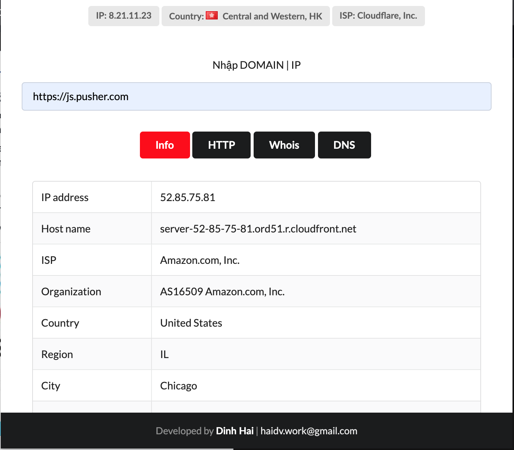

# Chrome Extension Checking Info, Whois, Ping, HTTP, DNS Website

## 									Platform used

1. Jquery v3.4.1
2. Semantic UI - 2.4.0

## 								Security Vulnerabilities

If you discover a security vulnerability within my application, please send an e-mail to **Dinh Hai** via [haidv.work@gmail.com](mailto:haidv.work@gmail.com). All security vulnerabilities will be promptly addressed.

# 
